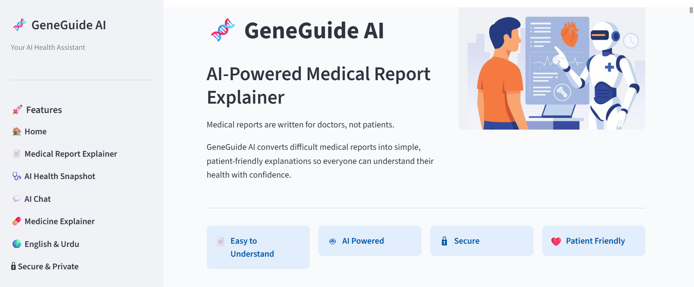
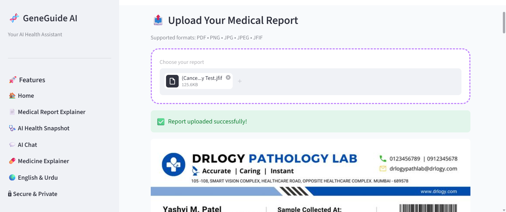
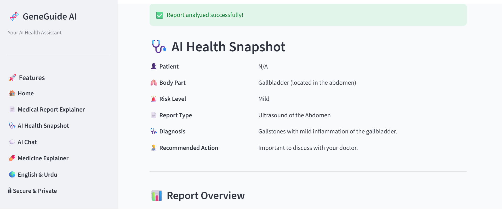
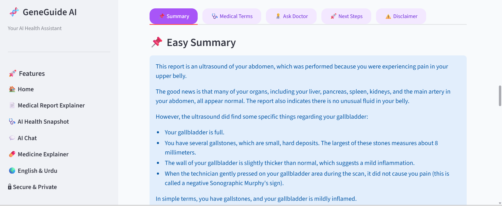
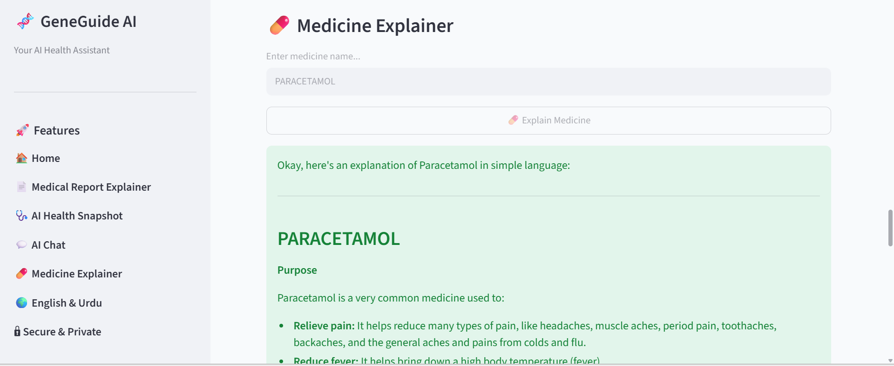

# 🧬 GeneGuide AI

> AI-powered medical report explainer that transforms complex medical reports into simple, patient-friendly language using Google's Gemini AI.

---

## 🌟 Overview

Understanding medical reports can be difficult for many patients because they often contain complex medical terminology. GeneGuide AI bridges this gap by converting technical medical language into easy-to-understand explanations, helping patients better understand their reports before consulting a healthcare professional.

This project is designed to improve healthcare accessibility through Artificial Intelligence while ensuring that medical decisions remain with qualified healthcare providers.

---

## ✨ Features

- 📄 Explain PDF medical reports
- 🖼️ Analyze medical report images
- 💬 AI-powered chat about uploaded reports
- 💊 Simple medicine explanation
- 🌍 English & Urdu language support
- 🔊 Text-to-Speech support
- 🛡️ Safe responses (No diagnosis or prescriptions)

---

## 🛠️ Tech Stack

| Category | Technology |
|----------|------------|
| Language | Python |
| Framework | Streamlit |
| AI Model | Google Gemini 2.5 Flash |
| PDF Processing | PyMuPDF |
| Image Processing | Pillow |
| Environment | python-dotenv |
| Speech | gTTS |

---

## 🎯 Problem Statement

Medical reports are often written using technical terminology that many patients cannot easily understand. This communication gap can lead to confusion, anxiety, and difficulty preparing meaningful questions for healthcare providers.

---

## 💡 Solution

GeneGuide AI converts complicated medical reports into clear, patient-friendly explanations while encouraging users to seek professional medical advice for diagnosis and treatment decisions.

---
---

# 📸 Application Preview

## 🏠 Home Page

---

## 📄 Report Explanation

---

## 📊 Health Snapshot

---

## 📝 Summary

---

## 💊 Medicine Explainer

---

## ⚠️ Disclaimer

GeneGuide AI is intended for educational purposes only.

It does **not** diagnose diseases, prescribe medications, or replace professional medical advice.

Always consult a qualified healthcare professional regarding medical decisions.

---

## 👩‍💻 Developer

**Fiza Ahmad**

Bioinformatics Student • AI Enthusiast • Healthcare Technology

---

⭐ If you found this project useful, consider giving it a star!
